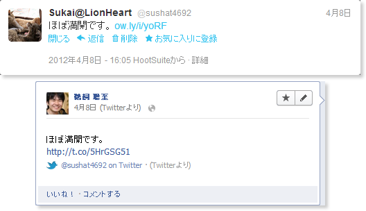
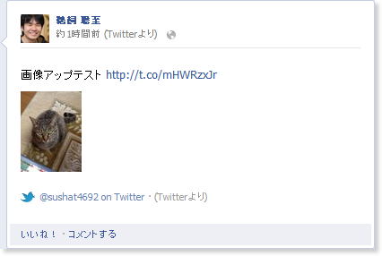

以前はFacebook上で画像をアップしても一覧表示ではそんなに大きく表示されなかったのであまり気にならなかったのですが、タイムライン表示が適用されて大きく見せることが出来るようになったので、出きれば大きく見せた方が良さそうだと感じたので、色々と方法を試してみました。

## 元々の方法

元々はHootSuiteを利用して、Twitterに投稿、そこからFacebookに連動させていました。

しかし、この状態ではTwitter、Facebook共にリンクが貼られるだけで、一覧からは画像を表示することが出来ませんでした。

## 試した方法色々

下記の方法で画像をアップしてみました。

<dl>
  <dt>Twitterに直接アップ　→　Facebookに連動</dt>
  <dd>Twitterは通常表示、Facebook上では小さい画像（右図参照）で表示。 
    <small>結果 : <a href="https://twitter.com/#!/sushat4692/status/200237222253953024">Twitter</a> / <a href="http://www.facebook.com/sushat4692/posts/3965220295340">Facebook</a></small>
  </dd>
  <dt>Flickrにアップ　→　TwitterとFacebookに連動</dt>
  <dd>Twitterは通常表示、Facebook上では小さい画像で表示。 
    <small>結果 : <a href="https://twitter.com/#!/sushat4692/status/200239637539733505">Twitter</a> / <a href="http://www.facebook.com/sushat4692/posts/3965363778927">Facebook</a></small>
  </dd>
  <dt>iPhoneアプリの“Soicha”を利用してアップ</dt>
  <dd>Twitterではリンクのみ、Facebook上では小さい画像で表示。 
    <small>結果 : <a href="https://twitter.com/#!/sushat4692/status/200250028567179265">Twitter</a> / <a href="http://www.facebook.com/sushat4692/posts/3965467061509">Facebook</a></small>
  </dd>
  <dt>iPhoneアプリの“Chirpie”を利用してアップ</dt>
  <dd>Twitter、Facebook共に通常表示。 
    ※TwitterとFacebookに二つアップされることになる。 
    <small>結果 : <a href="https://twitter.com/#!/sushat4692/status/200251723619643392">Twitter</a> / <a href="http://www.facebook.com/photo.php?fbid=3965499422318&set=a.3965499382317.2172970.1425375597&type=1">Facebook</a></small>
  </dd>
  <dt>iPhoneアプリの“Chirpie”を利用してFacebookにアップ→Twitterに連動</dt>
  <dd>Facebookは通常表示、Twitterへの連動が実行されない。 
    ※通常の「投稿」とは別扱いとして認識されている？ 
    <small>結果 : <del>Twitter</del> / <a href="http://www.facebook.com/photo.php?fbid=3965523022908&set=a.3965499382317.2172970.1425375597&type=1">Facebook</a></small>
  </dd>
  <dt>iPhoneアプリのFacebook公式アプリを利用してFacebookにアップ→Twitterに連動</dt>
  <dd>Facebookは通常表示、Twitterはツイート内容が「I posted a new photo to Facebook」となるが、画像は表示される。 
    <small>結果 : <a href="https://twitter.com/#!/sushat4692/status/200262684527181824">Twitter</a> / <a href="http://www.facebook.com/photo.php?fbid=3965736868254&set=a.3965737828278.2172977.1425375597&type=1">Facebook</a></small>
  </dd>
</dl>

ちなみに[FacebookからTwitterへの連動についてはこちらのサイト](http://attrip.jp/32212)の方法を利用しています。もしかしたら他の方法をとれば違う結果が出るかもしれません。

結局のところ理想系の状態は探しきれませんでしたが、Facebook上で大きい画像を表示させたい場合は、素直に公式のアプリを利用するのが良さそうな気がしました。

## 参考サイト

-   [FacebookからTwitterへ投稿(連動)する方法 | A!@attrip](http://attrip.jp/32212)
