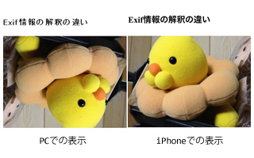

スマートフォンのカメラで撮影した画像をPCで表示する時に、上手く表示されないことがありますが、その画像をPCで編集を行うと、今度はスマートフォンで上手く表示されなくなることがあります。

条件が重なった時に生じる現象ですが、割と簡単に起きる内容だったので、忘れないように残しておきます。

## 原因

原因については写真を撮った時に、画像データ以外に一緒に保存される「Exif情報」と呼ばれるモノが影響した結果となります。

詳しい理由については[こちらの記事](http://hatomugi.sakura.ne.jp/forum/topic.php?id=84)や、[こちらの記事](http://zeromk.sakura.ne.jp/wp/?p=972)で紹介されていますので、今回の記事では割愛しておきます。

また、編集ソフトによっては「Exif情報」を書き換えることをしないので、PCとスマホの向きがチグハグのまま回転をしてしまうため、今度はスマートフォン側で上手く表示されなくなってしまいます。

その状態になったデータを置いておきます。[こちらからどうぞ](http://demo.sus-happy.net/sp/image/)。画像のようにPCとスマートフォンで見た目が違うと思います。

## 解消法

原因でお伝えしたとおり、「Exif情報」が問題となっているので、そちらを削除してしまうか、書き換えてしまえば問題ありません。

Windowsの場合は、非商用の場合のみ「[XnView](http://www.forest.impress.co.jp/lib/pic/piccam/picviewer/xnview.html)」と言うソフトで、書き換えることが出来、「[ExifEraser](http://gouka3.blog35.fc2.com/blog-entry-291.html)」で削除することが出来ます。

Macの場合はiPhotoで回転させて書き出すことで一緒に書き換えてくれるようです。

## 参考サイト

-   [iPhoneやiPod touch、Android携帯などで撮った写真の方向がおかしい « できるWEBサイトにする為に何が出来るのか](http://hatomugi.sakura.ne.jp/forum/topic.php?id=84)
-   [［iPhone］撮影した写真をPCで見ると左右に回転して表示されてしまう理由（”画像方向”について） – 実験場所](http://zeromk.sakura.ne.jp/wp/?p=972)
-   [iPhoneカメラのバグ？Exifに関して。](http://thatstwice.blog19.fc2.com/blog-entry-35.html)
-   [窓の杜 – XnView](http://www.forest.impress.co.jp/lib/pic/piccam/picviewer/xnview.html)
-   [画像をドラックするだけで自動でExif情報を削除するソフト「ExifEraser」 Flame of Heavens](http://gouka3.blog35.fc2.com/blog-entry-291.html)
